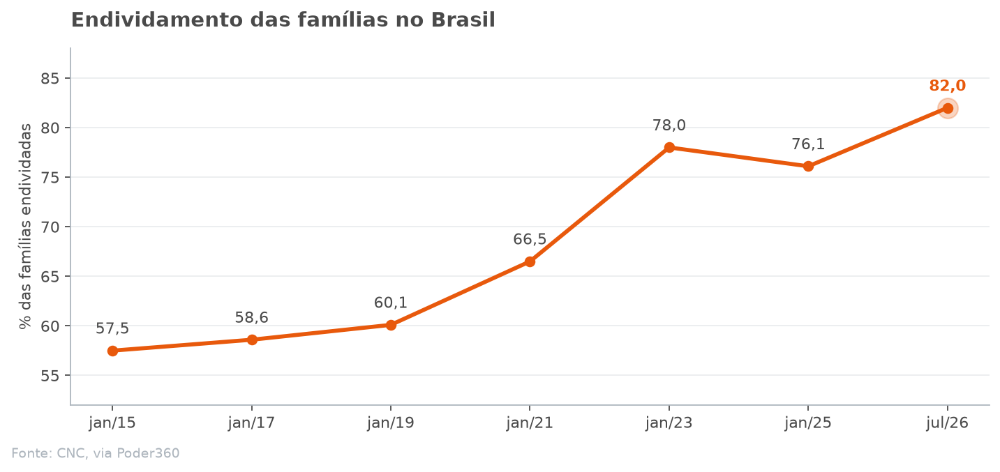
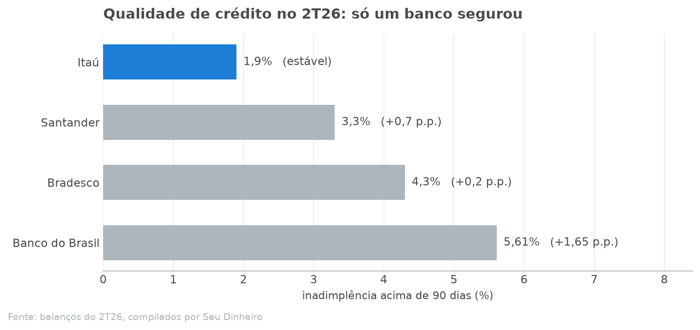
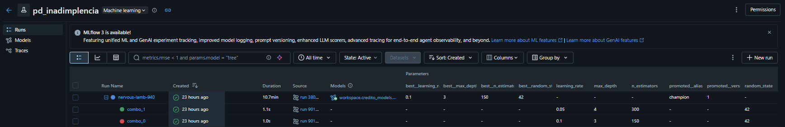
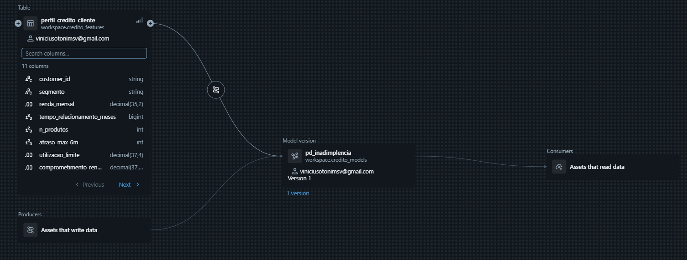
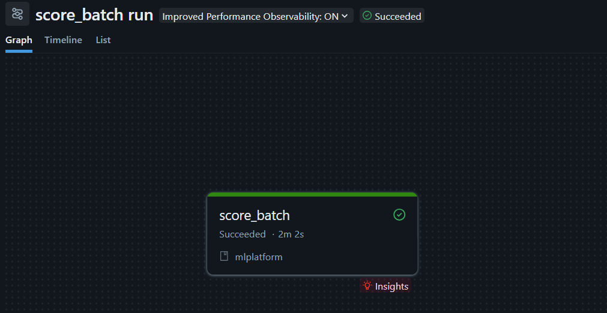
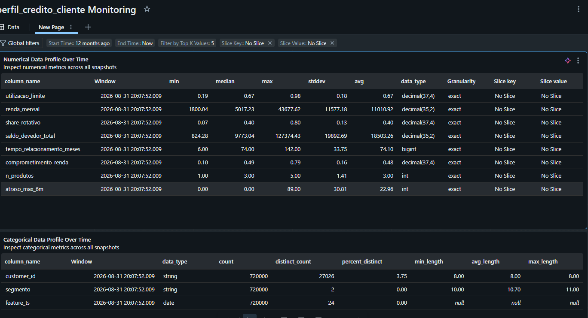

# Risco de crédito sobre uma plataforma de ML

**Atenção**: este repositório tem o intuito de realizar um comparativo entre um ecossistema sem padrões de MLOps e outro onde temos uma plataforma mais madura e preparada, e quais são os efeitos e ganhos disso. Não vamos nos aprofundar em conceitos de Ciência de Dados como estatística etc. Peguei este problema de qualidade de crédito apenas por ser algo recente e estar atrelado à empresa na qual eu trabalho.



**Oito** em cada dez famílias brasileiras estão endividadas. Em 2015 eram **seis**.

## Problema da qualidade de crédito no setor bancário

| Indicador | Valor | Variação em 12 meses |
| --- | --- | --- |
| Comprometimento de renda | 29,7% | +1,9 p.p. |
| Endividamento sobre renda | 49,9% | +1,3 p.p. |
| Inadimplência das famílias | 5,3% | +1,4 p.p. |
| Juros do rotativo | 451,5% ao ano | — |

Dados do Banco Central, referência fevereiro e março de 2026, via [Agência Brasil](https://agenciabrasil.ebc.com.br/economia/noticia/2026-04/juros-elevados-mantem-pressao-sobre-endividamento-das-familias).

Dessa forma, podemos ter a visibilidade de que boa parte da renda da família média brasileira já está comprometida antes mesmo de cair na conta e que, se levarmos em consideração a atual taxa de juros do Brasil, a *Taxa Selic*, a probabilidade de não cumprimento do crédito pode ser grande. Não vou entrar no mérito dos motivos desse maior endividamento, mas é fato que isso é um grande alerta para todo o setor bancário, levando em consideração que um dos braços mais relevantes é a sua qualidade de crédito.

No primeiro semestre, o banco Itaú conseguiu estabilizar o aumento da inadimplência, e podemos levantar uma série de questionamentos:

* Será que os clientes do banco Itaú são melhores? (Acredito que não exista uma diferença grande aqui comparando com os outros players.)

* Como o Itaú está conseguindo manter essa qualidade?

---



Esse problema de negócio que foi abordado e muitos outros que estão atrelados à jornada de ML podem ser resolvidos com uma plataforma robusta, governada e madura. Mas antes de explicar como resolver o problema, vamos entender qual é a situação oposta dessa ideação de plataforma.

## O problema de não ter uma plataforma consolidada para ML

O cientista até consegue definir qual será o algoritmo que melhor se encaixa para o problema, quais serão os hiperparâmetros utilizados e a normalização. Porém, ele já começa a se deparar com alguns problemas:

* Quais são as features? Ele não tem uma `Feature Store` madura o suficiente para evidenciar quais são as Feature Tables que ele deveria consumir.

* Como posso treinar o meu modelo e ter a confiança de que não vou ter problemas durante a etapa de treinamento, como Data Leakage, por exemplo?

* Como faço para promover o meu modelo? Quais são os caminhos para servir esse meu modelo?

* Como sei que meu modelo está performando bem após ser implementado?

Logo, tangibilizando esses questionamentos, podemos enxergar alguns problemas comuns em todo esse processo:

1. A criação das Feature Tables não é governada! Logo, podem existir **N** features feitas por domínios diferentes, mas contando praticamente a mesma história.

Também é comum criar a feature em tempo de execução e duplicar a criação em etapas diferentes da jornada (Ex.: treinamento e inferência). Isso pode causar um mismatch entre as informações e dificilmente será notado.

Ressalto que esse montante não governado de features apenas atrapalha a análise e a exploração do cientista, além de ser mais custoso para a instituição (tanto em processamento/compute quanto em storage).

2. Falta de clareza nos processos. O cientista enfrenta dificuldade em promover para os ambientes produtivos o seu modelo, que foi treinado em ambiente de experimentação. Idem para o contexto de inferência: não existe um padrão para a criação do seu JOB para o contexto batch, e do seu endpoint para o cenário online.

Note que todos esses problemas são causados pela falta de processos maduros para auxiliar o usuário (cientista de dados) em toda a sua jornada. Sem isso, o usuário fica cego e faz da forma que acha ideal. Pensando em ações tomadas de forma individual e em escala, isso definitivamente é um grande problema e difícil de ser resolvido.

## Como a plataforma resolve esses problemas

O objetivo é simples: dar o "caminho das pedras" para o cientista, porém não é trivial.

A ideia é que o cientista trabalhe de forma autônoma, consiga criar as suas features e publicá-las em nossa Feature Store — fomentando o reúso e tendo mais confiabilidade nos dados —, treinar o seu modelo de forma simples e com boas práticas/padrões estabelecidos pelo mercado, servir o seu modelo e, por fim, ter a visibilidade da necessidade de retreino do modelo conforme as novas safras.

O ganho aqui é deixar a experiência do cientista mais dinâmica (logo, ele consegue produtizar os seus modelos e chegar à etapa final sem muitos problemas), aplicar padrões e confiabilidade em toda a jornada e, por fim, também economizar custos em todo o processo para a instituição, evitando a redundância entre os processos.

## Como esse ecossistema foi montado


Aqui eu quebrei a jornada do cientista em componentes. O cientista apenas criaria as suas Feature Tables em nossa Feature Store, informaria qual é o algoritmo a ser utilizado, os hiperparâmetros que serão comparados, o percentual de cada `dataset` para as etapas de treino e as suas respectivas features. Por fim, ele escolhe qual tipo de inferência deseja fazer: batch ou online.

### Explicação sobre os componentes

**1. Feature store:** As feature tables são criadas `point-in-time` e utilizam também o recurso de `synced table`. Dessa forma, temos uma réplica da nossa feature no ambiente transacional, no `Lakebase`, possibilitando o consumo de baixa latência para o cenário de inferência online.

##### Exemplo de implementação para as Feature Tables

```text
features/
├── conf/variables.yml
├── pyproject.toml
├── src/credito_features/
│   └── configs.py            # Features do domínio
└── tests/
```

O arquivo de configuração inteiro:

```yaml
component: features
domain_package: credito_features
catalog: workspace
```

Declarar uma feature table é escrever uma função e marcá-la:

```python
@feature_table(
    domain="credito",
    entity_keys=["customer_id"],
    timestamp_key="feature_ts",
    sources=["raw.credito_posicoes"],
    online=True,
)
def perfil_credito_cliente(sources, window):
    ...
```

Todo o enxoval será abstraído para o cientista: ele vai apenas criar a sua Feature Table em nossa Feature Store e consumir.

**Linhagem entre a Feature Table e a Synced Table**


**Synced Table (Tabela no Lakebase)**


**2. Treino:** O split entre os 3 datasets é feito de forma temporal: treinamos o modelo com dados do passado, geramos `child runs` para comparar qual é o modelo com melhor desempenho e declaramos o `champion`. Por fim, testamos o modelo com "dados do futuro", sobre os quais o modelo não tinha visibilidade durante a etapa de treinamento, e validamos a sua sanidade.

Aqui conseguimos visualizar os hiperparâmetros utilizados em cada `child run` e quais prevaleceram após as comparações baseadas na métrica preenchida pelo cientista, promovendo assim o modelo **champion**.



Na etapa de treino, também utilizamos o `feature-lookup` para atrelar as features ao nosso modelo. Dessa forma, o modelo carrega consigo, de forma intrínseca, as features que foram utilizadas, permitindo um tracking mais fácil e outros benefícios técnicos que serão abordados posteriormente.



**3. Serving:** Temos dois processos de inferência. O **online**, em que servimos um endpoint de consumo do modelo, que utiliza `Synced Tables` (também conhecidas como Online Tables) para recuperar os dados frescos das Feature Tables.


Note que, em nosso request, não foi necessário passar as features para realizar a inferência. Isso é graças ao `feature-lookup` que mencionamos na etapa de treino.

Temos também o processo **batch**, em que geramos um workflow e consumimos as features do nosso catálogo de dados.



Aqui também temos outro ganho do `feature-lookup`. É muito comum, em um processo batch, ter uma task para geração da tabela **master**, constituída pelo join entre as feature tables e a tabela spine. Por conta do `feature-lookup`, não precisamos dessa task. Assim, aumentamos a eficiência do processo (tanto em performance quanto em custos) e também a qualidade da inferência, já que temos a certeza de que estamos consumindo as mesmas features utilizadas durante a etapa de treino.


**4. Monitoramento (Lakehouse Monitoring):** O Lakehouse Monitoring compara a safra atual com a safra em que o modelo foi treinado. Dessa forma, conseguimos ver com clareza se houve `drift` nos dados e disparar o retreino do modelo.

**trecho do dashboard gerado para acompanhamento**



### Qual foi o caminho da minha solução

Hoje meu ecossistema está totalmente atrelado ao Databricks. Talvez com um certo viés pelo fato de a empresa em que eu trabalho utilizar a ferramenta, mas é fato que, com ela, conseguimos centralizar todas as soluções pertinentes a esse problema.

Conseguimos estruturar a nossa Feature Store e ainda aplicar governança de dados nas tabelas; também conseguimos utilizar o `Lakebase` para transacionar as Feature Tables com baixa latência para o cenário da inferência online, além de conseguir promover o reúso do nosso componente em toda a plataforma.

## Como outros players reagiram ao mesmo problema

Os problemas que levantei acima não estão presentes apenas no setor bancário. A Uber e a Netflix passaram exatamente pela mesma dor e publicaram o que fizeram.

### Uber (Michelangelo e o Palette)

O problema que a Uber identificou foi exatamente o ponto que já mencionei. Cada time criava o seu pipeline e o modelo de produção não refletia o modelo que foi treinado pelo cientista no ambiente de experimentação.

Eles criaram uma **Feature Store centralizada, o Palette**, organizada por entidade e `feature group`. Eles usam Hive para a etapa de treino e Cassandra para leitura de baixa latência (inferência online). As features são referenciadas por **nome canônico** dentro da configuração do modelo (análogo ao comportamento do `feature-lookup` do Databricks), e a plataforma resolve sozinha se aquilo vira um join para geração da master ou um lookup no Cassandra.

### Netflix (Metaflow)

O Metaflow é uma biblioteca Python: o fluxo é uma classe com `@step`, análogo aos nodes do Kedro, DAGs do Airflow etc. O cientista não decide o que persistir. Ele foca apenas em aplicar a regra de negócio para gerar o seu modelo de ML. A infraestrutura é uma dependência via `@conda`/`@pypi`, a escala vem via `@batch`/`@kubernetes`, e a produção fica com um scheduler externo.

A mensagem aqui é a decisão tomada por ambas as empresas. No caso da Netflix, a responsabilidade está mais atrelada ao cientista, dando maior flexibilidade. Já a Uber foi para o caminho de uma plataforma que, de forma implícita, coordena o fluxo de vida do ecossistema de ML da instituição.

**Fontes:** [Meet Michelangelo (Uber)](https://www.uber.com/blog/michelangelo-machine-learning-platform/), [Michelangelo Palette (InfoQ)](https://www.infoq.com/presentations/michelangelo-palette-uber/), [Open-Sourcing Metaflow (Netflix)](https://netflixtechblog.com/open-sourcing-metaflow-a-human-centric-framework-for-data-science-fa72e04a5d9).

## O que muda no fim

Fazendo uma alusão aos questionamentos levantados no começo: como o Itaú conseguiu segurar o aumento da inadimplência? Não posso assumir qual é a metodologia adotada por eles, mas tudo indica que eles possuem uma plataforma governada e confiável para o contexto de ML (pensando no melhor dos cenários).

### As perguntas do começo, respondidas

No início, levantei alguns questionamentos do cientista de dados.. Todos já foram respondidos de forma mais detalhada em suas respectivas sessões [Explicação sobre os componentes](#explicação-sobre-os-componentes):

| A pergunta do começo | O que responde | A prova |
| --- | --- | --- |
| *Quais são as features que eu deveria consumir?* | Feature Store governada, com réplica no Lakebase | [linhagem da feature](docs/img/lineage-feature.png) · [tabela no Lakebase](docs/img/lakabase.png) |
| *Como treino sem cair em Data Leakage?* | split temporal e `feature-lookup` gravado no artefato | [child runs e champion](docs/img/runs-mlflow.png) · [linhagem do modelo](docs/img/lineage-model.png) |
| *Como promovo e sirvo o meu modelo?* | endpoint online e job batch, sem tabela master | [score online](docs/img/score-online.png) · [score batch](docs/img/score-batch.png) |
| *Como sei que ele continua performando?* | Lakehouse Monitoring comparando safra contra safra de treino | [dashboard de drift](docs/img/dashboard-drift.png) |

Note que aqui reduzimos a redundância dos processos, aumentamos a eficiência e temos uma maior confiança e maturidade nos processos. O trade-off aqui é a adoção dos usuários para deixar cada vez mais madura essa nossa plataforma utilizando os nossos componentes, mas isso é uma discussão para outro dia hahaha

### O ganho por persona

**Para o cientista:** ele fica focado apenas no que tange à sua matéria.

**Para o time de plataforma:** visibilidade e `tracking` de todo o ciclo de vida, com os componentes padronizados sobre um framework.

**Para a instituição:** eficiência e controle. O modelo chega à produção mais rápido; os domínios começam a reutilizar as suas peças e a compartilhar dados com outros domínios.

Uma plataforma de ML não deixa o modelo mais inteligente. Ela encurta a distância entre os dados mudarem, o modelo ficar sabendo e o cientista ter controle disso tudo.